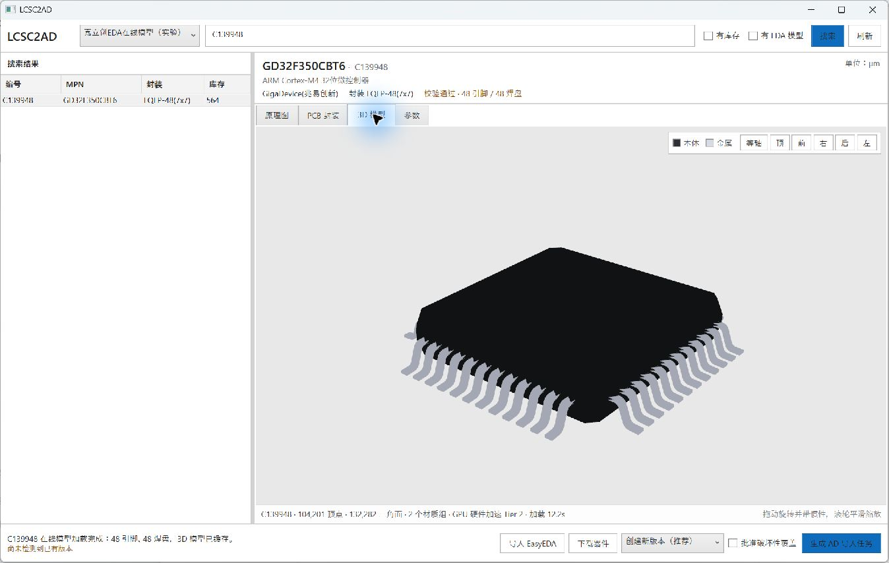
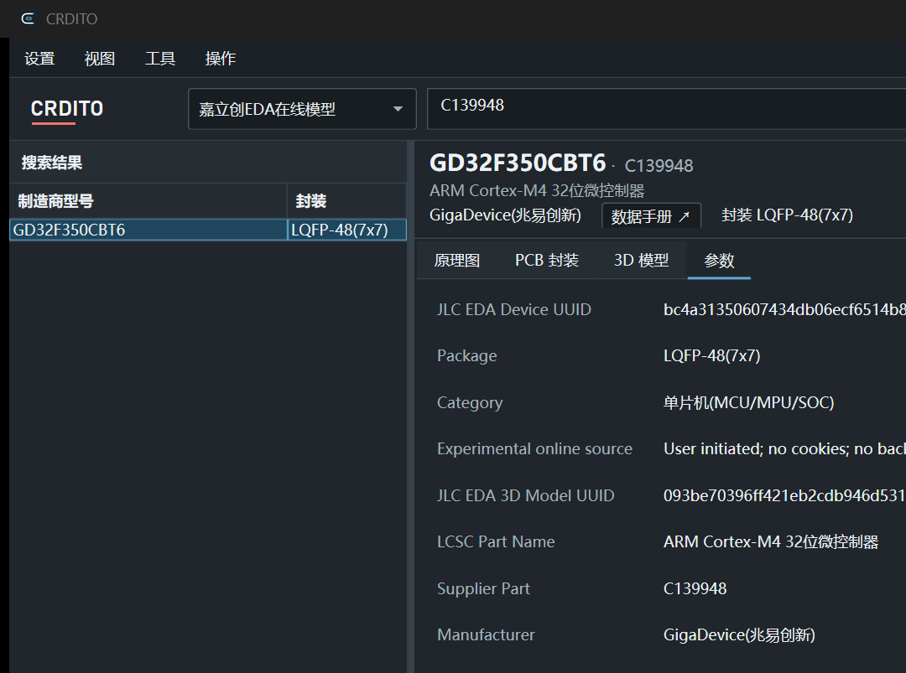
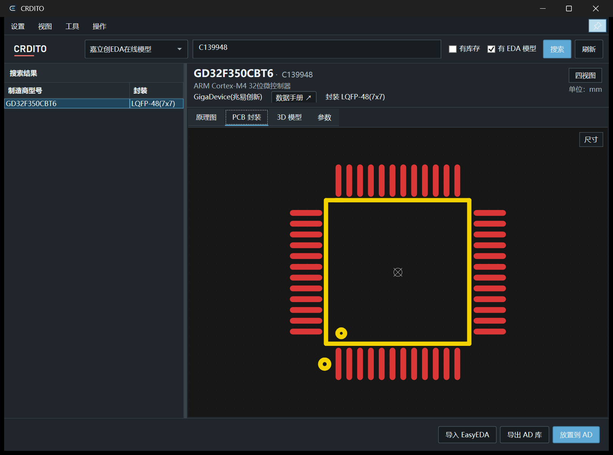

<div align="center">
  <picture>
    <source media="(prefers-color-scheme: dark)" srcset="src/Lcsc2Ad.App/Assets/Crdito-dark.svg">
    <source media="(prefers-color-scheme: light)" srcset="src/Lcsc2Ad.App/Assets/Crdito.svg">
    
  </picture>
  <h1>CRDITO</h1>
  <p><strong>A component-library bridge between JLC / LCSC and Altium Designer</strong></p>
  <p>Search, validate, preview, export, and place components directly into Altium Designer.</p>
  <p>
    <a href="README.md">简体中文</a> · English · <a href="README.ja.md">日本語</a>
  </p>
  <p>
    <a href="https://github.com/AROLLCHEN/CRDITO-Releases/releases/latest"></a>
    <a href="https://github.com/AROLLCHEN/CRDITO-Releases/releases"></a>
    
    
    
  </p>
  <p>
    <a href="https://github.com/AROLLCHEN/CRDITO-Releases/releases/download/v1.0.10/CRDITO-Setup-1.0.10-win-x64.exe"><strong>Download CRDITO 1.0.10</strong></a>
    ·
    <a href="https://github.com/AROLLCHEN/CRDITO-Releases/releases/latest">Release notes</a>
  </p>
</div>

---

CRDITO is a Windows desktop tool for electronics design workflows. It converts JLC / LCSC component data into validated Altium Designer schematic and PCB libraries, with previews for symbols, footprints, and STEP 3D models.

## Preview

<p align="center">
  
</p>

<table>
  <tr>
    <td width="50%" align="center">
      <br>
      <sub>Component information and copyable parameters</sub>
    </td>
    <td width="50%" align="center">
      <br>
      <sub>PCB footprint with final pad geometry</sub>
    </td>
  </tr>
</table>

## Practical guides

### 1. Search and validate a component

1. Select a data source at the top. Choose **JLC EDA online model** for online components.
2. Enter an LCSC part number, MPN, manufacturer, keyword, or package. Enable the stock and EDA-model filters when needed.
3. Choose one result from the left panel. CRDITO shows loading and validation states and enables export or placement only after both finish.
4. Confirm the MPN, package, description, and datasheet in the header. Do not export a component with a validation error; refresh or select the correct result first.

### 2. Inspect symbols, footprints, and 3D models

- Use the **Schematic**, **PCB footprint**, **3D model**, and **Parameters** tabs, or choose **View → Quad view** to compare them together.
- Use the mouse wheel to zoom and left-drag to pan schematic and footprint previews. Drag the 3D model to rotate it, use the wheel to zoom, and select isometric, top, bottom, front, back, left, or right camera presets.
- Choose **View → Show footprint dimensions** for overall dimensions. Choose **Tools → Measure length**, then click two points. Edge, vertex, center, horizontal, and vertical snapping are available; press `Esc` to leave measurement mode.
- In compact mode, the component header shows a **Datasheet** entry between the component details and validation state. It appears only for valid links and opens the document with the default browser.

### 3. Export Altium libraries

1. Under **Settings → Default schematic export fields**, choose the designator, comment, pin names, and pin numbers to display.
2. Select a component, choose **Export AD libraries**, and select an output directory.
3. Wait for binary readback and pin-to-pad mapping validation. A successful export contains `.SchLib`, `.PcbLib`, STEP, and `.validation.json` files.

### 4. Place directly in Altium Designer

1. Open the target project and schematic document in AD and keep the schematic canvas editable.
2. Choose **Place in AD** in CRDITO. Only one pending placement task is retained at a time.
3. Switch to AD and double-click inside the schematic canvas to begin placement. The component attaches to the pointer and uses the unified SchLib/PcbLib stored with the project.
4. To repeat the same component, enable **Continuous placement of the same component** under **Settings**. Each confirmed placement creates the next pending component; press `Esc` to stop.
5. Under **Settings → When Esc is pressed**, choose whether Esc deletes the current component or only ends placement.

> Tip: hold `Ctrl` and click a configurable top-menu action to assign a shortcut. CRDITO checks for conflicts before saving. **Always on top** and **Enter compact mode when pinned** keep selection and repeated placement in a compact workspace.

## Highlights

| Capability | Details |
| --- | --- |
| Component search | Search by LCSC part number, MPN, keyword, or package with incremental loading and local caching |
| Consistent preview | Render symbols, PCB footprints, and 3D models with the same conversion rules used for export |
| Native library export | Generate `.SchLib`, `.PcbLib`, STEP, and machine-readable validation reports without launching AD |
| Direct placement | Create a placement task in CRDITO and place it on the active AD schematic with a linked unified footprint library |
| Continuous placement | Optionally create the next placement of the same component after each confirmation; press `Esc` to stop |
| Strict validation | Check pins, pads, slots, custom pads, multi-unit symbols, model mapping, and binary library readback |
| Responsive inspection | Four-view layout, smooth zoom, measurement tools, camera presets, and cached meshes for large STEP files |

## Quick start

1. Download and install the latest build from [Releases](https://github.com/AROLLCHEN/CRDITO-Releases/releases/latest).
2. Search for a component and inspect its schematic, PCB footprint, and 3D views.
3. Export standalone libraries, or choose **Place in AD** to start the Altium Designer placement workflow.

The installer targets Windows 10/11 x64 and bundles .NET, NPNP, OCC, the VC++ runtime, and the AD placement extension. You can choose the installation directory; administrator privileges are required. Altium Designer and its commercial license are not included.

> Search, preview, and standalone export work without Altium Designer. Direct placement and PCB updates require a compatible Altium Designer installation.

## Output

```text
Component data
├── Altium schematic library (.SchLib)
├── Altium PCB library (.PcbLib)
├── STEP 3D model (.step)
└── Validation report (.validation.json)
```

Before publishing a library, CRDITO independently reads the generated binary files back. Export is blocked when pins are missing, identifiers are duplicated, pin-to-pad mappings disagree, or geometry validation fails.

## More information

- [Versions and release notes](https://github.com/AROLLCHEN/CRDITO-Releases/releases)
- [Issue tracker](https://github.com/AROLLCHEN/CRDITO-Releases/issues)
- [Software license](LICENSE)
- [Third-party notices](docs/THIRD-PARTY-NOTICES.md)

## Data, trademarks, and license

Online component data is fetched only in response to explicit user searches. CRDITO does not perform unattended bulk crawling or bypass login and CAPTCHA controls. Users must comply with the terms of JLC, LCSC, EasyEDA, Altium Designer, and the relevant content owners.

CRDITO is an independent interoperability tool and is not affiliated with, sponsored by, or endorsed by those companies. CRDITO is proprietary software. Copyright © 2026 AROLLCHEN. See [LICENSE](LICENSE) for the complete terms. The source repository remains private; official installers and update metadata are distributed only through the public [CRDITO-Releases](https://github.com/AROLLCHEN/CRDITO-Releases) repository.

<p align="right"><a href="#crdito">Back to top</a></p>
