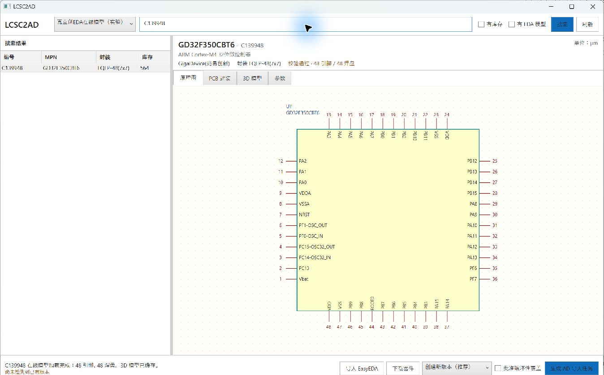

<div align="center">
  
  <h1>CRDITO</h1>
  <p><strong>JLC / LCSC と Altium Designer をつなぐ部品ライブラリーツール</strong></p>
  <p>部品の検索、検証、プレビュー、書き出し、Altium Designer への直接配置を一つのアプリで。</p>
  <p>
    <a href="README.md">简体中文</a> · <a href="README.en.md">English</a> · 日本語
  </p>
  <p>
    <a href="https://github.com/AROLLCHEN/CRDITO-Releases/releases/latest"></a>
    <a href="https://github.com/AROLLCHEN/CRDITO-Releases/releases"></a>
    
    
    
  </p>
  <p>
    <a href="https://github.com/AROLLCHEN/CRDITO-Releases/releases/download/v1.0.9/CRDITO-Setup-1.0.9-win-x64.exe"><strong>CRDITO 1.0.9 をダウンロード</strong></a>
    ·
    <a href="https://github.com/AROLLCHEN/CRDITO-Releases/releases/latest">リリースノート</a>
  </p>
</div>

---

CRDITO は電子設計ワークフロー向けの Windows デスクトップツールです。JLC / LCSC の部品データを検証済みの Altium Designer 回路図ライブラリーと PCB ライブラリーに変換し、シンボル、フットプリント、STEP 3D モデルをプレビューできます。

## プレビュー

<p align="center">
  
</p>

<table>
  <tr>
    <td width="50%" align="center">
      <br>
      <sub>PCB フットプリントとパッドのプレビュー</sub>
    </td>
    <td width="50%" align="center">
      <br>
      <sub>GPU アクセラレーション対応 STEP 3D プレビュー</sub>
    </td>
  </tr>
</table>

## 主な機能

| 機能 | 内容 |
| --- | --- |
| 部品検索 | LCSC 部品番号、MPN、キーワード、パッケージで検索し、追加読み込みとローカルキャッシュに対応 |
| 一貫したプレビュー | 書き出しと同じ変換ルールでシンボル、PCB フットプリント、3D モデルを表示 |
| ネイティブライブラリー出力 | AD を起動せずに `.SchLib`、`.PcbLib`、STEP、検証レポートを生成 |
| 直接配置 | CRDITO から配置タスクを作成し、AD の回路図上で統合フットプリントライブラリーと関連付けて配置 |
| 厳密な検証 | ピン、パッド、長穴、異形パッド、マルチユニットシンボル、モデル位置、バイナリー再読込を確認 |
| 快適な確認操作 | 4 ビュー、滑らかなズーム、寸法測定、視点切り替え、大容量 STEP のメッシュキャッシュに対応 |

## クイックスタート

1. [Releases](https://github.com/AROLLCHEN/CRDITO-Releases/releases/latest) から最新版をダウンロードしてインストールします。
2. 部品を検索し、回路図、PCB フットプリント、3D ビューを確認します。
3. ライブラリーを単独で書き出すか、**AD に配置**を選択して Altium Designer の配置フローを開始します。

インストーラーは Windows 10/11 x64 向けで、.NET、NPNP、OCC、VC++ ランタイム、AD 配置拡張を同梱しています。インストール先は選択可能で、管理者権限が必要です。Altium Designer 本体と商用ライセンスは含まれません。

> Altium Designer がなくても検索、プレビュー、単独書き出しは利用できます。直接配置と PCB 更新には互換性のある Altium Designer 環境が必要です。

## 出力ファイル

```text
部品データ
├── Altium 回路図ライブラリー (.SchLib)
├── Altium PCB ライブラリー (.PcbLib)
├── STEP 3D モデル (.step)
└── 検証レポート (.validation.json)
```

CRDITO はライブラリーを公開する前に、生成したバイナリーファイルを独立して再読込します。ピン不足、識別子の重複、ピンとパッドの対応不一致、形状検証エラーがある場合は書き出しを停止します。

## 詳細情報

- [バージョンとリリースノート](https://github.com/AROLLCHEN/CRDITO-Releases/releases)
- [問題の報告](https://github.com/AROLLCHEN/CRDITO-Releases/issues)
- [ソフトウェアライセンス](LICENSE)
- [サードパーティー通知](docs/THIRD-PARTY-NOTICES.md)

## データ、商標、ライセンス

オンライン部品データはユーザーが明示的に検索した場合のみ取得します。無人の一括クロールや、ログイン・CAPTCHA の回避は行いません。JLC、LCSC、EasyEDA、Altium Designer、および各コンテンツ権利者の条件を遵守してください。

CRDITO は独立した相互運用ツールであり、これらの企業との提携、スポンサー関係、推奨関係はありません。CRDITO はプロプライエタリソフトウェアです。Copyright © 2026 AROLLCHEN. 詳細は [LICENSE](LICENSE) を参照してください。ソースリポジトリは非公開で、公式インストーラーと更新メタデータは公開 [CRDITO-Releases](https://github.com/AROLLCHEN/CRDITO-Releases) リポジトリからのみ配布します。

<p align="right"><a href="#crdito">トップへ戻る</a></p>
